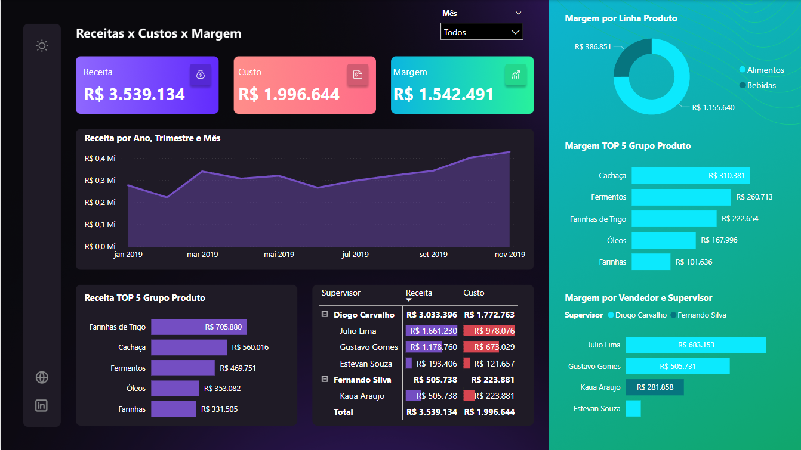

# 📊 Projeto Power BI - Análise de Vendas

Este repositório contém um projeto completo de Business Intelligence utilizando o Power BI, desenvolvido durante um minicurso prático. O objetivo foi aplicar os conceitos fundamentais da análise de dados para criar um dashboard dinâmico e interativo, capaz de auxiliar a tomada de decisão em ambientes empresariais.

---

## 🚀 Objetivos do Projeto

- Aprender e aplicar os principais conceitos de BI (Business Intelligence);
- Criar um fluxo completo de análise: desde a coleta dos dados até a visualização interativa;
- Demonstrar raciocínio analítico e domínio sobre a transformação de dados;
- Produzir um dashboard que entregue valor real para o negócio.

---

## 🧠 Por que trabalhar com análise de dados?

- **Tomada de decisão mais inteligente**: Entender se os indicadores estão positivos ou negativos, batendo metas, acompanhando o financeiro e fluxo de caixa;
- **Aumento de valor profissional**: Com dashboards bem estruturados, você aumenta sua capacidade analítica e torna sua hora mais valiosa;
- **Business Intelligence**: Ferramentas como o Power BI permitem transformar dados brutos em insights rápidos e acionáveis.

---

## 📁 Base de Dados Utilizada

1. **BaseVendasCompleta.xlsx**
   - Contém os registros de vendas com colunas como: data, produto, quantidade, valor unitário, cliente, vendedor e região.
   - Permite análise temporal e categórica com alto nível de segmentação.

2. **CadastroProdutos.xlsx**
   - Arquivo auxiliar com dados como custo unitário e categoria dos produtos.
   - Utilizado para cálculo de indicadores financeiros e enriquecimento da análise.

---

## 🧱 Etapas do Desenvolvimento

### 1️⃣ Extração de Dados
- Arquivos .xlsx carregados no Power BI;
- Fonte de dados simulada semelhante a sistemas ERP;
- Navegação pelas etapas de carregamento facilitando rastreabilidade.

### 2️⃣ Transformação dos Dados (Power Query)
- Limpeza e padronização das tabelas;
- Junções entre tabelas baseadas em colunas-chave;
- Criação de novas colunas como Receita = Quantidade x Valor;
- Definição correta dos tipos de dados para evitar erros na modelagem.

### 3️⃣ Modelagem
- Relacionamento entre tabelas por meio de chaves como Código do Produto;
- Aplicação do modelo estrela para facilitar o uso de medidas e segmentações;
- Organização da estrutura para garantir consistência nas análises.

### 4️⃣ Cálculos e Indicadores (DAX)
- Medidas como Receita Total, Custo Total, Lucro e Margem de Lucro;
- Uso da função `RELATED()` para buscar dados entre tabelas relacionadas;
- Aplicação de funções como `SUMX` e `CALCULATE` para cálculos dinâmicos.

### 5️⃣ Visualização e Design
- Gráficos de linha, colunas, barras e cartões de KPI;
- Segmentações por Região, Produto, Cliente e Período;
- Design limpo e visualmente informativo com foco na tomada de decisão.

---

## 🖼️ Prints do Dashboard

> ⚠️ Substitua os links abaixo pelas imagens reais após realizar upload no GitHub ou adicionar via markdown.

---

## ✅ Conclusão

Este projeto demonstra de forma prática como é possível transformar dados brutos em painéis que auxiliam decisões empresariais com mais segurança e agilidade. Ao aplicar corretamente os pilares do BI — extração, transformação, modelagem, cálculo e visualização — garantimos que o profissional cresça junto com o negócio.

---

## 🧠 Tecnologias e Ferramentas Utilizadas

- Power BI Desktop
- Power Query
- Linguagem DAX
- Excel (como fonte de dados)

---

## ✍️ Autor

**Juan Mendes**  
Estudante de Empreendedorismo e Startups  
🔗 [LinkedIn](https://www.linkedin.com/in/juan-mendes-739084273)

## Print do Dashboard

---

